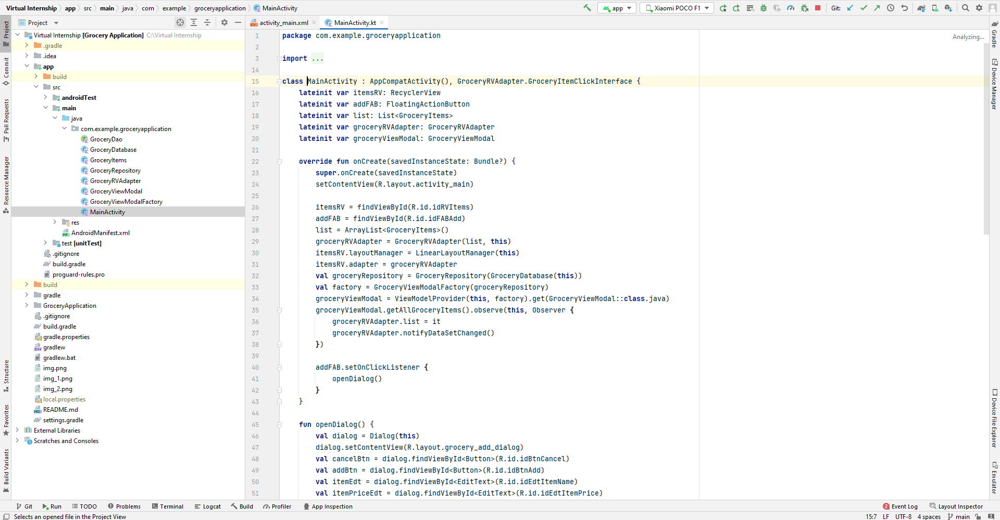

"# SPSGP-97705-Virtual-Internship---Android-Application-Development-Using-Kotlin" 
# Google Devloper Profile - [developers.google.com/harsh/](https://developers.google.com/profile/u/112750375600627451096)
# Description 
This app helps you to make a proper list of grocery items with quantity and price so that, when you go for shopping next time you don't forget anything to buy and have a track of your expenditure for budget maintenance.

# Screenshots
## Workspace

## APP

